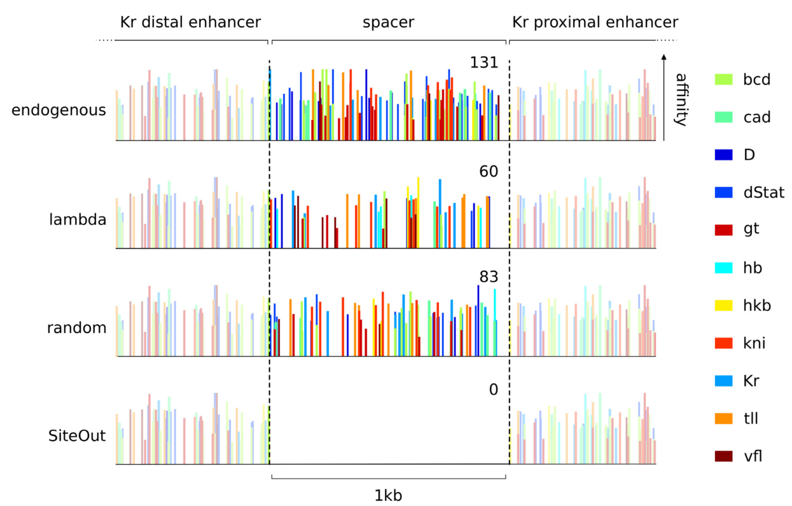

# SiteOut: a tool to design motif-free DNA sequences

SiteOut was published [here](http://journals.plos.org/plosone/article?id=10.1371/journal.pone.0151740).

SiteOut allows to remove specific nucelotide motifs, such as trancription factor binding sites, from a DNA sequence. It can be used to design a new sequence from scratch, to refine a predefined sequence, or to create neutral spacers between functional sequences. The code will either look for explicit motifs or will use Patser to check for predicted motifs based on the provided frequency matrices (FMs). Collections of FMs ready to be used with SiteOut for D. melanogaster and yeast transcription factors are available in this repository: [Yeast FMs](yeast_pwms.zip), [D. mel FMs](Dmel_pwms.zip).

1) To run SiteOut locally you need to compile [Patser](http://stormo.wustl.edu/resources.html) and give it execution permits. Once you've done that, you will have to edit line 147 in SiteOut.py to indicate your path to Patser

`os.system("your_path_to_patser/patser-v3b -w -v -p -f fileName -c -l %.4f > %s " % (cutoff, tempFile))`

2) Once you have Patser ready in your system, place the FMs you wish to use inside a folder called 'pwm', placed inside the same folder as siteout.py and the rest of the execution files. You can then run SiteOut:

`python siteout.py Pvalue GCcontent  SpGCcontent Sequences.txt motifs.txt`

- **Pvalue** is the threshold P value for binding motif identification
- **GCcontent** is the GC content of the motif-free sequence that SitePut will design
- **SpGCcontent** is the average GC content of the genome of the species under study
- **Sequences.txt** is the sequence design file: plain file with the functional sequences that won't be touched by SiteOut intercalated with the length of the motif-free spacers between them. [Example](Sequences.txt)
- **motifs.txt** is a file with the explicit motifs to be avoided. [Example](motifs.txt)

